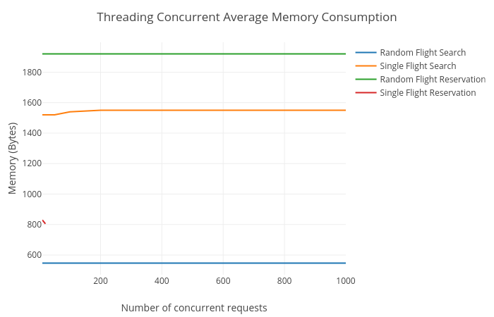

# Software Transactional Memory
Edgar A. Margffoy - 201412566

## Performance Tests
To test the performance of the flight reservation system, four different stress testing scenarios were defined, each one of the them correspond to multiple concurrency events where either requests refer to multiple elements (Random search) on the database, or all the requests want to request a single object. Both scenarios are presented for reading and writing operations.

All the results were collected using [Benchee](https://github.com/PragTob/benchee) using the following testing routine:

```elixir
id = Enum.random(:mnesia.dirty_all_keys(Flights))
nodes = [10, 20, 50, 100, 200, 500, 1000, 2000, 5000, 10000]

Enum.map(nodes, fn n ->
  FlightsThread.random_read_test(n)
  FlightsThread.concurrent_read_test(n)
  FlightsThread.random_write_test(n)
  FlightsThread.concurrent_write_test(n)
end)
```

### Memory Consumption
|  |
|:--:|
| *Figure 1:* Memory footprint across different number of concurrent nodes |

### Time Latency
|  |
|:--:|
| *Figure 2:* Time response across different number of concurrent nodes |


## Conclusions
One of the main limitations of the classic Threading/Lock/Semaphore approach to concurrency is that performance scaling is bounded by the total number of System threads available on the system. Also, the locking mechanism represents a drawback in terms of time performance; the synchronization blocking time could be used to perform other tasks while a thread/process is awaiting for a lock to be released., Finally, one of the main drawbacks regarding the ``Mutex`` library on Elixir is that of setting a timeout to adquire a lock; if a node exceeds the timeout while waiting for a lock release, it has to be restarted.

With respect to the overall performance in terms of memory and time, the flight reservation system implementation has on average, a linear scaling in time performance, and a low and constant memory consumption. However, it is necessary to notice that the system has issues scaling beyond 1000 concurrent nodes, as the operations exceed the lock timeout. Also, the theoretical total number of concurrent requests is bounded by the maxmimum number of processes that can be spawned on the BEAM VM. For instance, after testing the operation ``concurrent_read``, it was possible to observe that it was not possible to add more processes beyond a high watermark of 100000.
