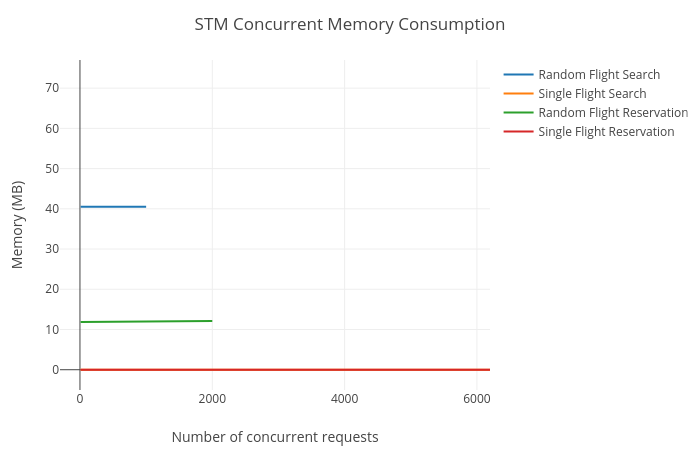
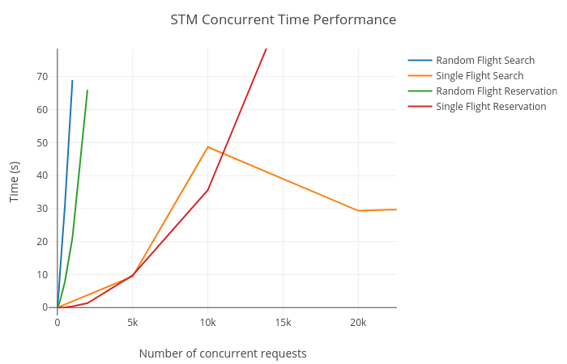

# Software Transactional Memory
Edgar A. Margffoy - 201412566

## Performance Tests
To test the performance of the flight reservation system, four different stress testing scenarios were defined, each one of the them correspond to multiple concurrency events where either requests refer to multiple elements (Random search) on the database, or all the requests want to request a single object. Both scenarios are presented for reading and writing operations.

All the results were collected using [Benchee](https://github.com/PragTob/benchee) using the following testing routine:

```elixir
id = Enum.random(:mnesia.dirty_all_keys(Flights))
nodes = [10, 20, 50, 100, 200, 500, 1000, 2000, 5000, 10000]

Enum.map(nodes, fn n ->
  Benchee.run(%{"random_read" => fn ->
      FlightsStm.random_reading_load_test() end,
      "concurrent_read" => fn ->
        FlightsStm.concurrent_reading_load_test()
      end,
      "random_writing" => fn ->
        FlightsStm.random_writing_test()
      end,
      "concurrent_writing" => fn ->
        FlightsStm.concurrent_writing_test(id)
      end},
      memory_time: 2, parallel: n)
end)
```

### Memory Consumption
|  |
|:--:|
| *Figure 1:* Memory footprint across different number of concurrent nodes |

### Time Latency
|  |
|:--:|
| *Figure 2:* Time response across different number of concurrent nodes |


## Conclusions
With respect to implementing a flight reservation system using STM (Mnesia), it is possible to conclude that while this concurrency model ensures that all clean (atomic) operations are recorded without having to wait for other concurrent operations to finish, it has a performance bottleneck due to the overhead accounted by the log journaling time costs. Regarding memory consumption, it is possible to observe that each process keeps a constant memory footprint, thus, the memory complexity for this model is linear in the number of concurrent processes for all operations.
