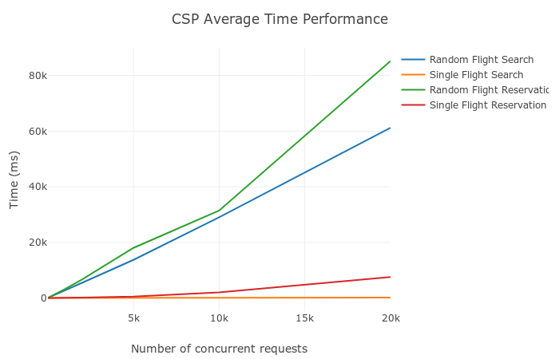

# Software Transactional Memory
Edgar A. Margffoy - 201412566

## Performance Tests
To test the performance of the flight reservation system, four different stress testing scenarios were defined, each one of the them correspond to multiple concurrency events where either requests refer to multiple elements (Random search) on the database, or all the requests want to request a single object. Both scenarios are presented for reading and writing operations.

All the results were collected using [Benchee](https://github.com/PragTob/benchee) using the following testing routine:

```elixir
nodes = [10, 20, 50, 100, 200, 500, 1000, 2000, 5000, 10000, 20000]

Enum.map(nodes, fn n ->
  Benchee.run(%{"random_read" => fn ->
      FlightsStm.random_reading_test(n) end,
      "concurrent_read" => fn ->
        FlightsStm.concurrent_reading_test(n)
      end,
      "random_writing" => fn ->
        FlightsStm.random_writing_test(n)
      end,
      "concurrent_writing" => fn ->
        FlightsStm.concurrent_writing_test(n)
      end},
      memory_time: 2)
end)
```

### Memory Consumption
|  |
|:--:|
| *Figure 1:* Memory footprint across different number of concurrent nodes |

### Time Latency
|  |
|:--:|
| *Figure 2:* Time response across different number of concurrent nodes |


## Conclusions
Using CSP Channels as synchronization mediums on concurrency problems helps to alleviate several issues present on classical Threading communication, such as the awareness on the usage of thread-safe collections or the one-by-one processing restriction introduced by Locks and Semaphores that only allow a single node to isolate a scope, while the remaining ones have to wait for the release of the synchronization mechanism; CSP channels do behave as collections, thus, it should be possible to synchronize and store values contained on a channel. Also, CSP channel buffers can have several behaviours and buffer sizes which allow multiple nodes to get into the same atomic scope.

With respect to the implementation, the concurrency synchronization model is focused on the channel instead on the elements that are put onto it, therefore, adding channels is straight-forward and transparent to the developer.

Finally, as it can be seen on the performance results, the overall behaviour of the CSP model is linear with respect to the number of concurrent nodes. Also it does have an average constant memory consumption for each of the load tests proposed on the previous section, this implies that CSP is efficient in terms of memory. However, it is possible to observe that on the worst case, when multiple nodes request/write to different elements, CSP has a lower performance with respect to the more general concurrency case, when multiple nodes want to modify/read the same element simultaneously.
